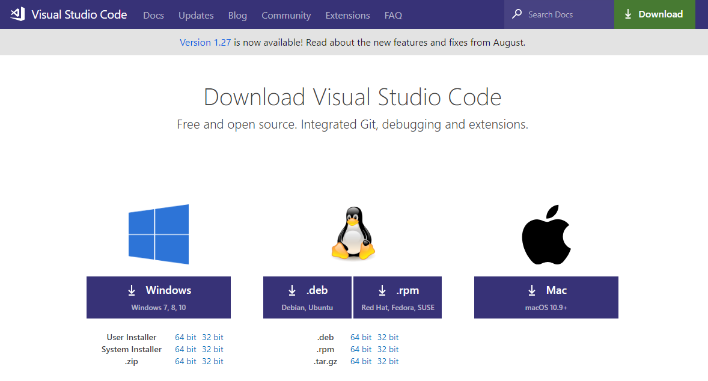

# [Ai3 Logo](https://blog.ai3.fr/wp-content/themes/blog_ai3/images/xai3-rouge.png.pagespeed.ic.zcQpdtKV3W.webp) Projet d'auto-formation
## Pré-requis à installer
---
- NodeJS
- Visual Studio Code
    - Extensions: 
        - Angular Language Services
        - Angular support
        - Angular Typescript snippets
        - TSLint
- Visual Studio 2017
    - ASP.NET Core 2.1+
- Azure CLI
- Angular CLI

---

### NodeJS
---
Récupérer NodeJS sur le [site officiel de NodeNodeJS](https://nodejs.org/en/download/current/). Prendre la dernière version stable. 

*Suivre le wizard d'installer en utilisant les valeurs par défault.*

### Visual Studio Code (VS Code)
---
Récupérer VS Code sur le [site officiel de VS Code](https://code.visualstudio.com/download)

*Suivre le wizard d'installer en utilisant les valeurs par défault.*