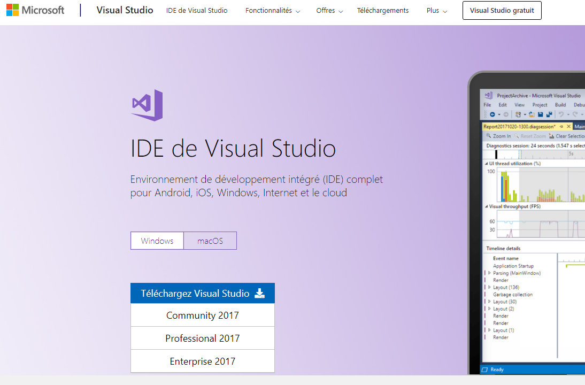
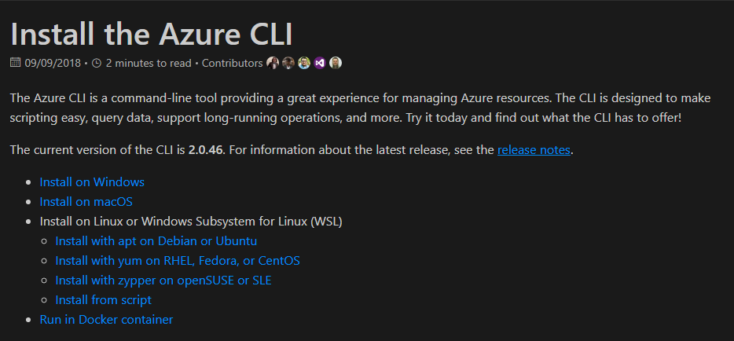

## Pré-requis à installer
- NodeJS
- Visual Studio Code
    - Extensions: 
        - Angular Language Services
        - Angular support
        - Angular Typescript snippets
        - TSLint
- Visual Studio 2017
    - ASP.NET Core 2.1+
- Azure CLI
- Angular CLI


### NodeJS
----------
Récupérer NodeJS sur le <a href="https://nodejs.org/en/download/current/" target="_blank">site officiel de NodeNodeJS</a>. Prendre la dernière version stable. 


*Suivre le wizard d'installation en utilisant les valeurs par défault.*

Tester ensuite que l'installation s'est bien déroulée et que les outils sont prêts à être utilisés:
1. Démarrer une invite de command/terminal
2. Tester les 2 commandes suivantes afin de valider l'installation de NodeJS et de NPM qui est embedded:
    - ``` bash
        node -v
    - Si un numéro de version est retournée => OK
    - ``` bash 
        npm -v 
    - Si un numéro de version est retournée => OK
    > 


### Visual Studio Code (VS Code)
---------------------------------
Récupérer VS Code sur le <a href="https://code.visualstudio.com/download" target="_blank">site officiel de VS Code</a>


*Suivre le wizard d'installation en utilisant les valeurs par défault.*

### Visual Studio 2017 Professional
------------------------------------
Récupérer Visual Studio 2017 Professional sur le <a href="https://visualstudio.microsoft.com/fr/vs/" target="_blank">site officiel de Microsoft</a>



Suivre le wizard d'installation en utilisant les valeurs par défault.

Lorsqu'il vous sera proposé de choisir différents types de workload, sélectionner au moins les 2 suivantes:
- ASP.NET and web development
- Azure development


### Azure CLI (command line tool)
------------------------------------
Récupére Azure CLI sur le <a href="https://docs.microsoft.com/en-us/cli/azure/install-azure-cli?view=azure-cli-latest" target="_blank">site</a>



### Angular CLI
Après avoir bien installé NodeJS, vous pouvez suivre la procédure suivante afin d'installer [Angular CLI](https://cli.angular.io/):

1. Démarrer une invite de command/terminal
``` bash
npm install -g @angular/cli@latest
```
2. Angular Cli est maintenant installé "globalement" sur votre machine dans sa dernière version disponible.