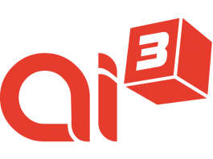
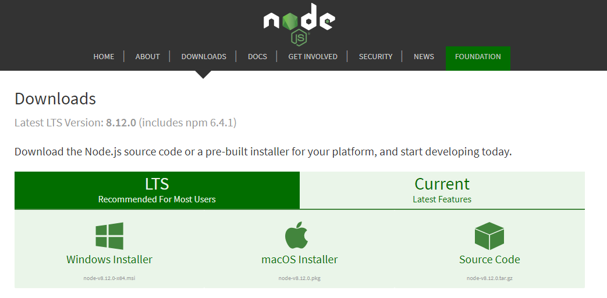
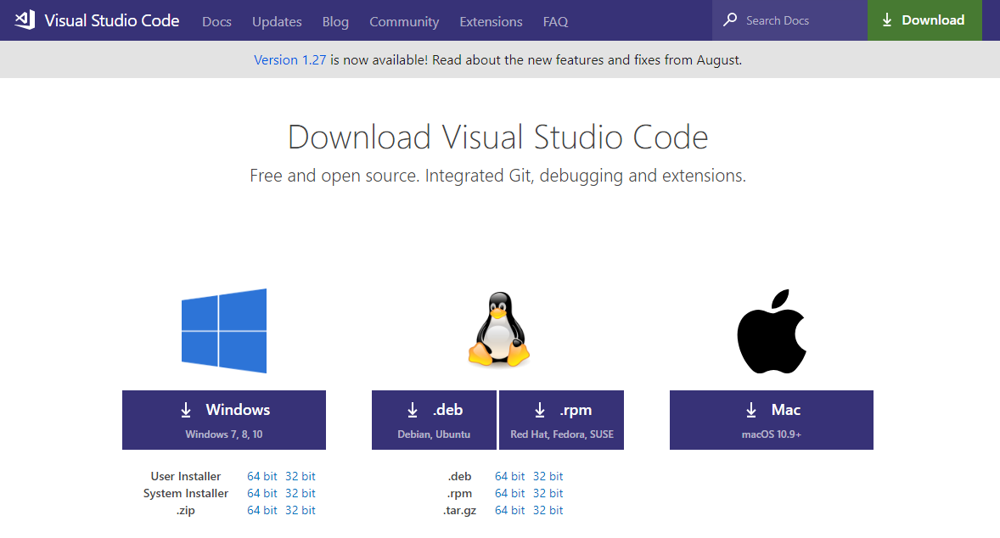
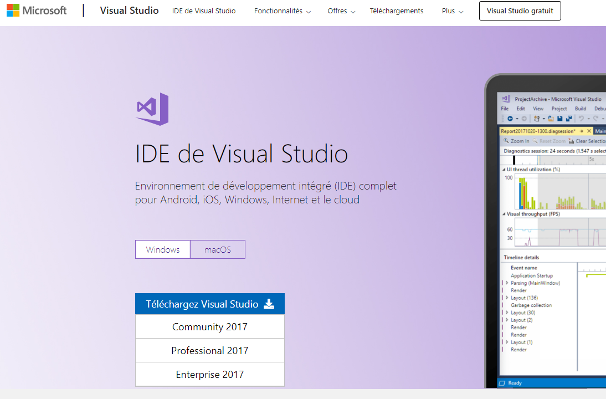

#  Projet d'auto-formation
## Pré-requis à installer
- NodeJS
- Visual Studio Code
    - Extensions: 
        - Angular Language Services
        - Angular support
        - Angular Typescript snippets
        - TSLint
- Visual Studio 2017
    - ASP.NET Core 2.1+
- Azure CLI
- Angular CLI

### NodeJS
Récupérer NodeJS sur le [site officiel de NodeNodeJS](https://nodejs.org/en/download/current/). Prendre la dernière version stable. 

*Suivre le wizard d'installation en utilisant les valeurs par défault.*

### Visual Studio Code (VS Code)
================================
Récupérer VS Code sur le [site officiel de VS Code](https://code.visualstudio.com/download)

*Suivre le wizard d'installation en utilisant les valeurs par défault.*

### Visual Studio 2017 Professional
===================================
Récupérer Visual Studio 2017 Professional sur le [site officiel de Microsoft](https://visualstudio.microsoft.com/fr/vs/)

*Suivre le wizard d'installation en utilisant les valeurs par défault.*

### Azure CLI (command line tool)
=================================