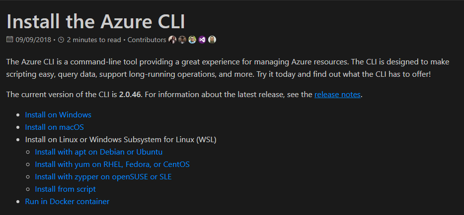

#  Projet d'auto-formation
## Pré-requis à installer
- NodeJS
- Visual Studio Code
    - Extensions: 
        - Angular Language Services
        - Angular support
        - Angular Typescript snippets
        - TSLint
- Visual Studio 2017
    - ASP.NET Core 2.1+
- Azure CLI
- Angular CLI

### NodeJS
----------
Récupérer NodeJS sur le <a href="https://nodejs.org/en/download/current/" target="_blank">site officiel de NodeNodeJS</a>. Prendre la dernière version stable. 

*Suivre le wizard d'installation en utilisant les valeurs par défault.*

### Visual Studio Code (VS Code)
---------------------------------
Récupérer VS Code sur le <a href="https://code.visualstudio.com/download" target="_blank">site officiel de VS Code</a>

*Suivre le wizard d'installation en utilisant les valeurs par défault.*

### Visual Studio 2017 Professional
------------------------------------
Récupérer Visual Studio 2017 Professional sur le <a href="https://visualstudio.microsoft.com/fr/vs/" target="_blank">site officiel de Microsoft</a>

*Suivre le wizard d'installation en utilisant les valeurs par défault.*

### Azure CLI (command line tool)
------------------------------------
Récupére Azure CLI sur le <a href="https://docs.microsoft.com/en-us/cli/azure/install-azure-cli?view=azure-cli-latest" target="_blank">site</a>

